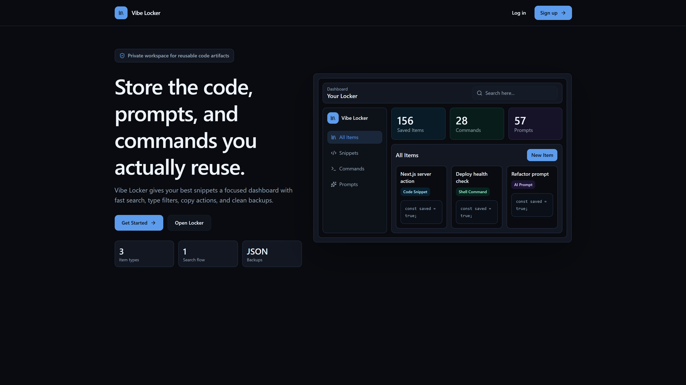
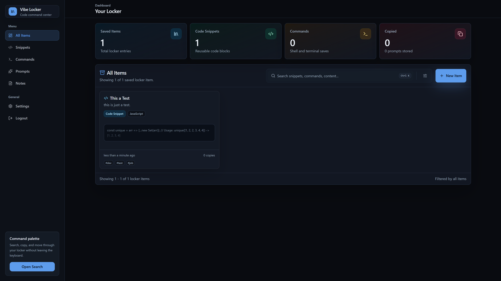
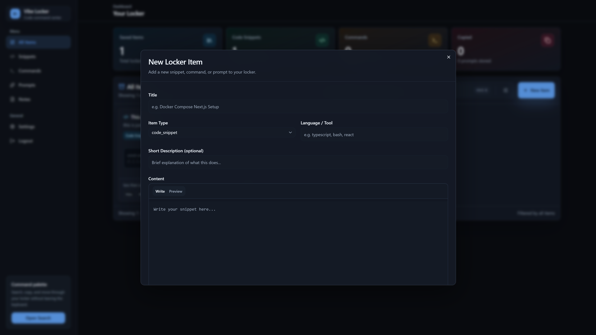
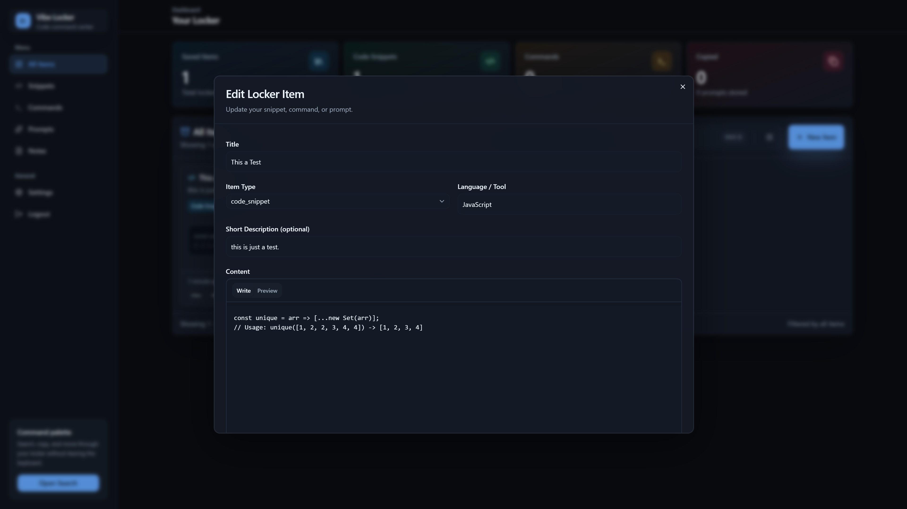
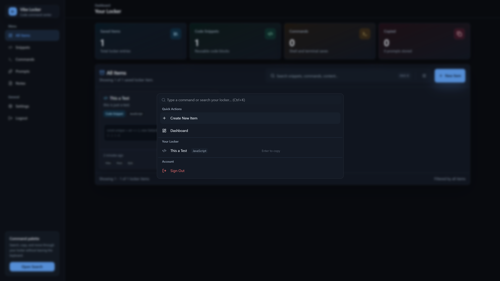
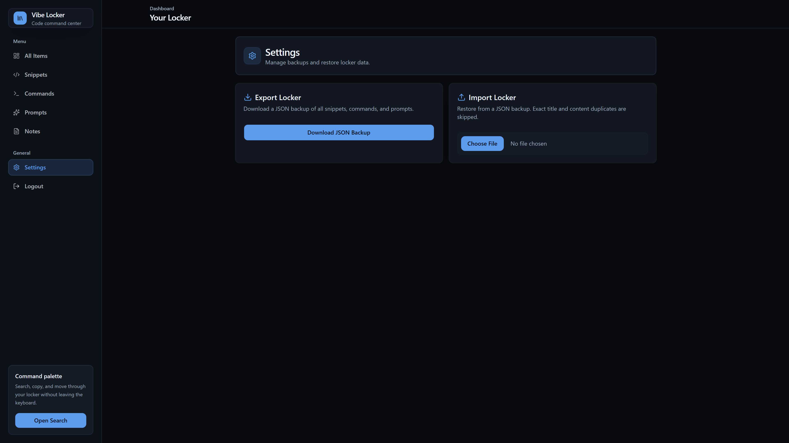

# Vibe Locker

Vibe Locker is a modern web application built to organize, save, and manage your digital items efficiently. It features a sleek user interface, secure authentication, and seamless command palette integration to quickly find what you need.

## 🚀 Features

- **Secure Authentication**: User sign-up, login, and secure session management.
- **Dashboard Management**: View, add, edit, and organize your items in a clean dashboard.
- **Command Palette**: Quickly search and navigate through your locker.
- **Dark Mode**: Built-in support for light and dark themes.
- **Responsive Design**: Works seamlessly on desktop and mobile devices.

## 📸 Screenshots

### Landing Page


### Dashboard


### Add New Item


### Edit Item


### Command Palette


### Settings


## 🛠 Tech Stack

- **Framework**: [Next.js](https://nextjs.org/) (App Router)
- **Language**: [TypeScript](https://www.typescriptlang.org/)
- **Styling**: [Tailwind CSS](https://tailwindcss.com/)
- **Components**: [shadcn/ui](https://ui.shadcn.com/)
- **Icons**: [Lucide React](https://lucide.dev/)
- **Database / Auth**: [Supabase](https://supabase.com/)
- **Rate Limiting / Caching**: [Upstash Redis](https://upstash.com/)

## 💻 Getting Started

First, clone the repository and install dependencies:

```bash
pnpm install
```

Set up your environment variables. Create a `.env.local` file and add your Supabase and Upstash credentials:

```bash
NEXT_PUBLIC_SUPABASE_URL=your_supabase_url
NEXT_PUBLIC_SUPABASE_ANON_KEY=your_supabase_anon_key
UPSTASH_REDIS_REST_URL=your_upstash_url
UPSTASH_REDIS_REST_TOKEN=your_upstash_token
```

Run the development server:

```bash
pnpm dev
```

Open [http://localhost:3000](http://localhost:3000) with your browser to see the result.
